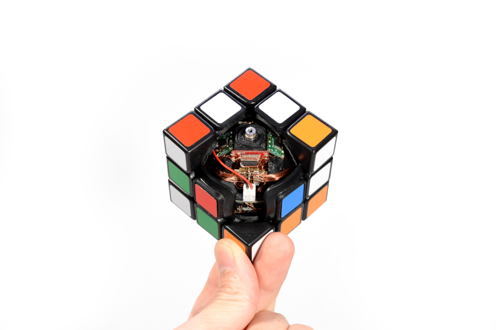

these are all the project ideas that I've thought have the teensiest bit of [alpha](https://en.wikipedia.org/wiki/Alpha_(finance)):

- some way to download the knowledge of textbooks into the brain

    - read textbooks -> complete the practice problems -> apply the knowledge in the real-world... but where's the fun in that?? we're here to take shortcuts and do shit quicker. PrOdUcTiViTy HaCk??

    - steering -> trial and error -> simulating -> mentalizing -> speaking -> writing -> whatever tf an LLM is epistemologically

    - 'edutain'. query for lesson content. lesson is delivered. you learn new shit. maybe it's cropped in half and there's some subway surfers playing at the bottom to keep your dumb fucking monkey brain engaged. there's immediately some active element of applying the knowledge after you learn it. through quizzing, flashcards, review, summary, maybe ['teaching the content' back to a quizzative LLM playing the curiousity driven 5yo?](https://fs.blog/feynman-technique/). 

    - it has to be a habit, or else you don't come back and the neural pathway never really develops. => it must give you dopamine post lesson completion, otherwise it never becomes a habit. gamification only works so well. the user would have to be capable of some type of long-term planning.

    -  spaced repition is key. especially if you're trying to learn something that you're not going to be applying in your day to day. there's a reason immersion is the best way to learn a language. your trial and error cycle is near instantaneous, when a one-off lesson is bullshit. long Speak -- short Duolingo. $DUO did some things right (enough that they could get a ticker), but who's actually become fluent paying for a duo account. supplementary, great tool. introductory, great tool. long-term viable option to learn a new language? absolutely not. i have a 169 streak in espanol rn. one "lesson" per day. could i have a conversation? fuck no. i could definitely stumble through some phrases and get an idea across. but no, the trial and error cycles are too short to make a dent on my neural pathways. how are you going to learn spanish if the only language you use is english? the answer is, you're not. you're trying to fight the underlying mechanisms of your brain and you will lose. **how fast are your dev cycles?**  

    - likely, issues w/ neural plasticity. you get *much* worse at learning the older you get. when's the last time you heard a 'hot take' from grandma? the real killers realize that's their cue to learn while they can. grandma used to be a free-thinker too, you know.

    - and there is no such thing as a download wrt. knowledge. unless the content has an immediate impact hacking your emotions you need some type of spaced repition to really engrain it in your neurons

    - is Brilliant doing this? not really. the lesson curation is great. the UI/UX is nice. but, do people actually learn and retain the lesson contents? maybe on occasion, but it's stacked against you. you have to -- **have to** -- repeatedly come back to that content in order to truly learn it. 

- rubik's cube alarm clock

    - surprisingly, no one's shipped here as of 05/30

    - first MVP:

    - [read this, build this](https://makezine.com/projects/smart3-the-self-solving-rubiks-cube/)

    - strip a speed cube ([or hackable smart cube?](https://speedcubeshop.com/a/blog/smart-cubes-the-future-of-speed-cubing) price is a concern, but POC could be nice)

    - microelectronic magic...

    - speaker, alarm at specified time (mobile UI...), mute when turns are made, celebratory chime when solved

    - second MVP:

    - scramble any cube before bed

    - alarm on phone

    - mute for M-timesteps

    - solve cube 
    
    - show that it's solved via camera

    - Out of scope:

    - self-scrambling

    - LED stickers

    - charging stand

    

- TikTok but brainrot filtered

    - somehow isolate positive EV content

    - moondream?

    - ties into edutain a tad.

- weekly review dashboard

    - dexcom data

    - github stats

    - some lagging indicators for wellbeing

    - measurable progress metrics for long-term goals

- llm chat w/ my handwritten journal entries in notability

    - related to weekly review dashboard in a way

    - convert entries to .txt

    - VDB and semantic search given query?

    - weekly review, you can just pass them in w/ a timestamp

    - obsidian-esque knowledge graph visualization

- personal insulin production

    - CRISPR up some e. coli that cooks insulin for you

    - hype, fuck pharma

- t1d network effect app

    - not 0->1, literally solved by a subreddit

    - interesting build though, if you have nothing else ig

- local voice model on phone

    - i like this

    - upload .epub file

    - listen to it being read

    - usable UI

    - high quality voice running on-edge